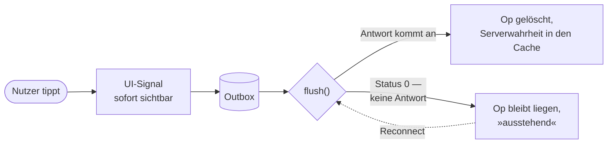
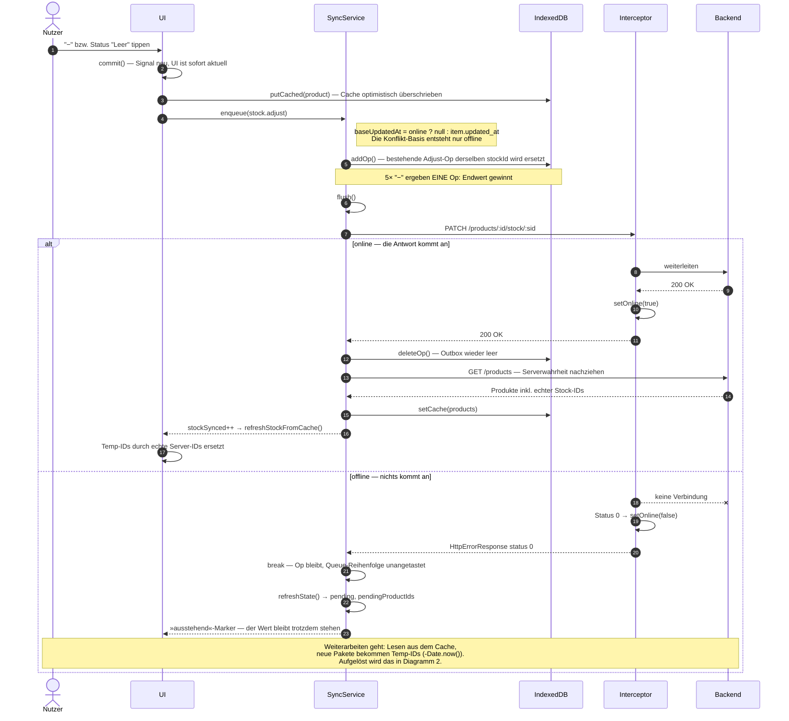
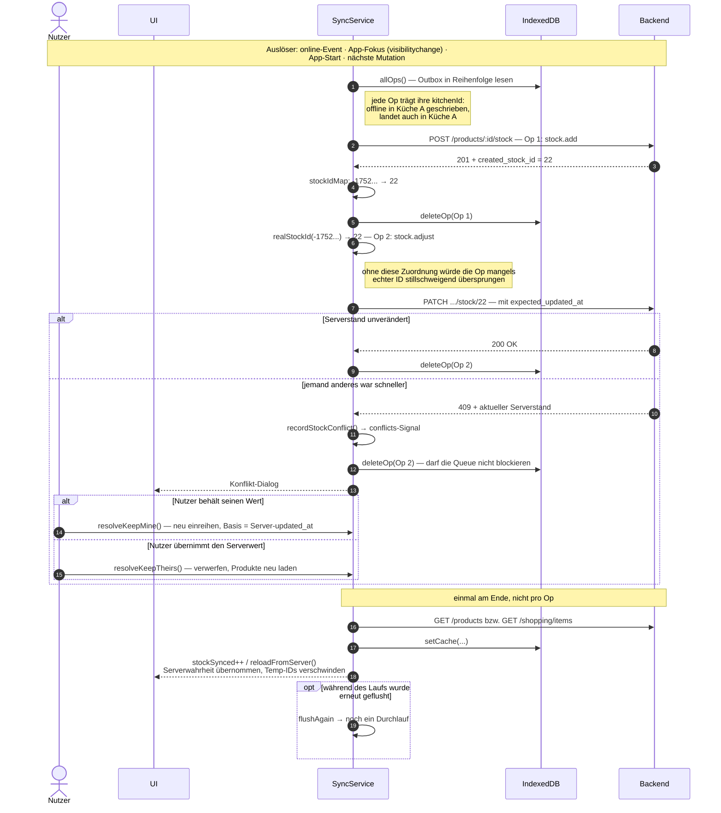

# Sync-Architektur — ein Schreibpfad, zwei Ausgänge

Stand: 19.07.2026 · Code: `services/sync.ts`, `services/live.ts`,
`services/offline-db.ts`, `services/connectivity.ts`,
`interceptors/connectivity-interceptor.ts`,
`pages/product-detail/product-detail.ts` · Backend: `events.py`,
Middleware in `main.py`, SSE-Endpoint in `api/kitchens.py`

## Die Kernaussage in einem Bild

**Es gibt keinen getrennten Online-Pfad.** Jede Schreibaktion nimmt immer
denselben Weg. Ob Netz da ist, entscheidet sich erst ganz am Ende — an genau
einer Gabelung:

Die UI ist in **beiden** Fällen sofort aktuell — sie wartet nie auf den Server.
Offline bleibt die Op einfach in der Outbox liegen, bis ein Reconnect sie
nachliefert. Genau deshalb fühlt sich die App offline identisch an.

## Wer ist wer

| Kürzel | Baustein                 | Aufgabe                                                          |
|--------|--------------------------|------------------------------------------------------------------|
| `UI`   | ProductDetail / Shopping | schreibt optimistisch ins Signal, reiht die Op ein               |
| `SY`   | `SyncService`            | Outbox verwalten, `flush()`, Temp-IDs auflösen, Konflikte melden |
| `LV`   | `LiveService`            | SSE-Verbindung + `rev`-Signal: Änderungen anderer Geräte         |
| `DB`   | IndexedDB                | `cache` (Lesen offline) + `outbox` (Schreiben offline, FIFO)     |
| `IC`   | Connectivity-Interceptor | erkennt am echten Antwortverhalten, ob wir online sind           |
| `API`  | Backend                  | die einzige Quelle der Wahrheit                                  |

Der Online-Zustand kommt **primär** aus echtem Antwortverhalten: jede
*erfolgreiche* Antwort setzt `online = true`, Status 0 (nichts kam an) setzt
`online = false`. 4xx/5xx lassen ihn unangetastet — der Server ist ja
erreichbar, nur die Anfrage war schlecht. `navigator.onLine` ist trotzdem nicht
ganz raus: er liefert den Startwert, und die Browser-Events `online`/`offline`
setzen das Signal zusätzlich als Hinweis (`ConnectivityService`).

---

## 1 · Der Schreibvorgang

Bis `flush()` ist alles identisch. Der Unterschied zwischen online und offline
ist die eine `alt`-Gabelung unten.

---

## 2 · Der Reconnect

Kein Gegenstück zu Diagramm 1, sondern ein eigenes Ereignis: es hat einen
eigenen Auslöser und Logik, die es online nie braucht.

Das Beispiel ist der heikelste reale Fall — offline ein Paket angelegt **und**
direkt danach auf demselben Paket „Leer" getippt. Op 2 zeigt dabei auf eine ID,
die es serverseitig noch gar nicht gibt.

---

## 3 · Live-Updates (die andere Richtung)

Diagramm 1/2 sind *meine* Schreibvorgänge. Änderungen **anderer** Geräte kommen
per Server-Push herein — es gibt kein Polling:

- **Backend:** Jede erfolgreiche Mutation unter `/api/kitchens/{id}/…` bumpt
  über eine Middleware einen Revisionszähler pro Küche (`events.bus`, rein im
  Prozessspeicher — Produktion läuft als ein Uvicorn-Prozess). Mutationen ohne
  Küchen-ID in der URL (Invite annehmen/ablehnen, Registrierung mit
  Küchen-Code, Farbwechsel) bumpen explizit am Endpoint.
  `GET /api/kitchens/{id}/events` ist ein SSE-Stream: pro Bump ein
  inhaltsloses `change`-Event (Bursts werden koalesziert), alle 25 s ein
  Keepalive, `Last-Event-ID` löst beim Reconnect sofort ein Catch-up-Event aus.
- **Frontend:** `LiveService` hält pro aktiver Küche eine `EventSource` und
  bündelt alles in ein `rev`-Signal (300 ms Debounce). Events **und**
  App-Fokus/Online-Wechsel bumpen `rev` — Fokus lädt also auch bei leerer
  Outbox nach. Solange die Outbox noch Ops enthält, wird der Bump zurückgestellt
  (`dirty`) und erst nach dem Flush ausgeführt, damit ein Server-Snapshot nie
  optimistischen, noch nicht synchronisierten Zustand überschreibt.
- **Konsumenten:** Einkaufsliste (inkl. Badge), Mitglieder/Farben und
  Küchen/Rollen/Einladungen laden bei jedem `rev`-Bump zentral neu; offene
  Seiten (Bestand, Produktdetail, Archiv, Küchenverwaltung) registrieren sich
  über `live.onChange(...)`. Die Events sind bewusst inhaltslos — Konsumenten holen
  sich, was sie anzeigen, deshalb können Quer-Effekte (Bestandsänderung erzeugt
  Auto-Eintrag, Trip materialisiert Bestand) nie verloren gehen.
- **Selbstheilung:** `EventSource` reconnected von allein; gibt sie endgültig
  auf, repariert ein 30-s-Intervall die Verbindung, solange die App sichtbar
  ist (das ist kein Daten-Polling — ohne tote Verbindung passiert nichts).

Direkt in der DB ausgeführtes SQL erzeugt **kein** Event — solche Änderungen
erscheinen erst beim nächsten Fokus/Reconnect.

---

## Was die Diagramme nicht zeigen

|                          | online                               | offline                                            |
|--------------------------|--------------------------------------|----------------------------------------------------|
| `expected_updated_at`    | `null` — letzter Schreiber gewinnt   | `item.updated_at` als Konflikt-Basis, 409 möglich  |
| Lesen                    | GET, danach Cache-Refresh            | ausschließlich aus dem IndexedDB-Cache             |
| Temp-IDs (`-Date.now()`) | Sekundenbruchteile bis zur echten ID | leben bis zum Reconnect, `stockIdMap` löst sie auf |

Online wird also **bewusst kein** Konflikt geprüft: zwei Geräte, die gleichzeitig
online sind, überschreiben sich gegenseitig, letzter Klick gewinnt. Der
409-Dialog existiert ausschließlich für Änderungen, die offline entstanden sind.

## Fallstricke

- **Temp-IDs überleben den Sync.** Ein Paket, das auf einer offenen Produktseite
  angelegt und weiterbearbeitet wird, behält lokal seine negative ID auch
  nachdem der `add` durchgelaufen ist. Nur `stockIdMap` rettet die folgenden
  Adjust-/Remove-Ops. Lässt sich eine Temp-ID nicht auflösen (der `add` kam nie
  durch), wird die Op stillschweigend übersprungen. Die Map ist in IndexedDB
  persistiert und wird bei leerer Outbox aufgeräumt — sie übersteht damit auch
  einen App-Neustart zwischen geglücktem `add` und wartender Folge-Op.
- **Ops werden bei Fehlern verworfen, nicht wiederholt.** Nur Status 0 bricht die
  Schleife ab und behält die Queue. Jeder andere Fehler — auch der 409 — löscht
  die Op, damit sie den Rest nicht blockiert; verworfene Ops landen im
  persistierten `failed`-Signal und werden als Banner angezeigt, verloren geht
  also nichts *still*. Beim 409 entsteht der Ersatz erst wieder durch
  `resolveKeepMine()`; der Dialog lässt sich nicht wegklicken (nur
  „meins"/„deren"), und `conflicts` ist ebenfalls persistiert — ein Reload vor
  der Entscheidung verwirft den Konflikt nicht. Liefert der Server zufällig
  denselben Wert wie meiner, wird ohne Dialog still aufgelöst.
- **Der Collapse gilt nur für `stock.adjust`.** Mehrfaches Abhaken derselben
  Einkaufsposition erzeugt weiterhin eine `shopping.toggle`-Op pro Klick.
- **Trip-Abschluss ist online-only** (`ShoppingService.complete`) — er läuft nicht
  über die Outbox.
